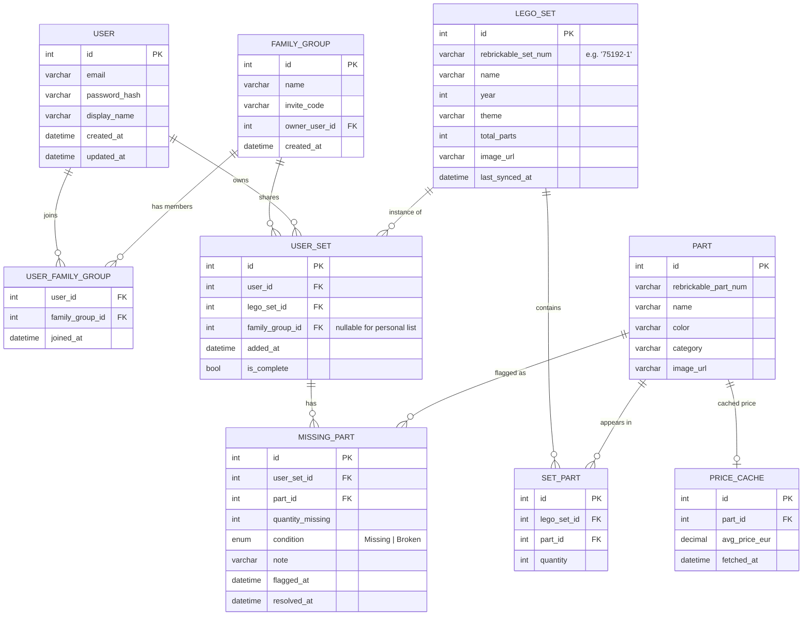

# MyBricks – Legacy Data Migration Plan

## Overview
We need to migrate data from the old `MyBricksDatabaseDump.sql` to the new EF Core based `.NET` backend. The legacy schema relies on flat tables (`user_sets`, `missing_parts`) whereas the new schema uses normalized canonical tables (`LegoSets`, `Parts`) with user-specific join tables (`UserSets`, `MissingParts`).

## User Review Required
> [!IMPORTANT]
> **User Passwords / Logins:** The legacy database used Auth0/Google OAuth IDs (e.g., `google-oauth2|115286979863881724566`) as the `user_id`. When we import these into the new ASP.NET Core Identity system:
> - We will create placeholder user accounts for these IDs so the relationships remain intact.
> - Since we don't have emails or passwords in the dump, how should users log in to the new system? (We can either set a default dummy password for everyone, or just rely on the fact that you will re-add Google Login later to match these IDs).

## Proposed Changes

### 1. Prepare & Import Legacy Dump
To avoid overwriting the current `mybricks` database used by EF Core, we will edit the SQL dump to target a new database schema:
#### [MODIFY] [MyBricksDatabaseDump.sql](file:///c:/Users/robwi/OneDrive/Bureaublad/Rob/MyBricksV2/MyBricksDatabaseDump.sql)
- Change `CREATE DATABASE IF NOT EXISTS mybricks` to `CREATE DATABASE IF NOT EXISTS mybricks_legacy`
- Execute the dump inside the running Docker MySQL container: `docker exec -i mybricks-mysql mysql -uroot -pdev < MyBricksDatabaseDump.sql`

### 2. Update Migration Tool Configuration
#### [MODIFY] [backend/tools/MyBricks.Migration/MyBricks.Migration.csproj](file:///c:/Users/robwi/OneDrive/Bureaublad/Rob/MyBricksV2/backend/tools/MyBricks.Migration/MyBricks.Migration.csproj)
- Update `<TargetFramework>` from `net6.0` to `net8.0`.
- Add project references to `MyBricks.Domain` and `MyBricks.Infrastructure` so the tool can use the `ApplicationDbContext`.

### 3. Implement Migration Logic
#### [MODIFY] [backend/tools/MyBricks.Migration/Program.cs](file:///c:/Users/robwi/OneDrive/Bureaublad/Rob/MyBricksV2/backend/tools/MyBricks.Migration/Program.cs)
- Orchestrate the process using `LegacyDbReader` and `NewDbWriter`.

#### [NEW] `backend/tools/MyBricks.Migration/LegacyDbReader.cs`
- Use Dapper to extract data from `mybricks_legacy` tables (`families`, `family_members`, `user_sets`, `missing_parts`).

#### [NEW] `backend/tools/MyBricks.Migration/MigrationMapper.cs`
- Transform legacy `families` → `FamilyGroup`.
- Extract distinct `set_num` from `user_sets` → `LegoSet`.
- Map `user_sets` → `UserSet`.
- Extract distinct `part_num` and `color_name` from `missing_parts` → `Part`.
- Map `missing_parts` → `MissingPart` (linking to the newly created `UserSet`).
- Extract distinct `user_id` values → `ApplicationUser` (Identity).

#### [NEW] `backend/tools/MyBricks.Migration/NewDbWriter.cs`
- Bulk insert the mapped entities into the new `mybricks` database using `ApplicationDbContext`.
- Check for existing records to ensure idempotency.

## Verification Plan
### Automated Tests
- The migration tool will output logs showing the number of sets, parts, and missing parts processed.

### Manual Verification
- We will run the tool and then query the new `mybricks` database to confirm that the `UserSets` and `MissingParts` tables contain the correct row counts corresponding to the old database.

---
# MyBricks – Full-Stack Architecture Blueprint

## Overview

MyBricks is a collaborative LEGO inventory tracker. Users can catalogue their sets, flag missing/broken parts, share access within a Family Group, and generate an aggregated shopping list with Rebrickable-sourced pricing data.

**Stack:** .NET 8 Web API (Clean Architecture) · React 18 + TypeScript + Vite · MySQL 8 · Rebrickable API v3

---

## Open Questions

> [!IMPORTANT]
> Please review these before I begin scaffolding files:

1. **Auth provider**: Self-hosted ASP.NET Core Identity (JWT). This fully supports adding Google Login later via Identity's external login providers.
2. **Family Group ownership model**: Users can belong to multiple groups (Many-to-Many). Users also have a personal list (UserSets with `FamilyGroupId = null`).
3. **Legacy DB**: What does the old schema look like roughly? (table names, key columns) — so I can design the migration tool accurately.
4. **Hosting target**: Local dev only for now, or are you planning Azure / Railway / Render deployment? This affects whether we add Docker Compose scaffolding.
5. **Shopping list pricing**: Rebrickable surfaces "price guide" data (BrickLink market prices). Are these acceptable, or do you have another pricing source in mind?

---

## Proposed Changes

### 1 — .NET Solution Structure (Clean Architecture)

```
MyBricks/
├── MyBricks.sln
│
├── src/
│   ├── MyBricks.Domain/               # Enterprise business rules
│   │   ├── Entities/                  # User, FamilyGroup, LegoSet, Part, MissingPart …
│   │   ├── Enums/                     # PartCondition (Missing, Broken), …
│   │   ├── Exceptions/                # Domain-specific exceptions
│   │   └── Interfaces/                # Repository contracts (IUserRepository, …)
│   │
│   ├── MyBricks.Application/          # Use-case orchestration
│   │   ├── Common/
│   │   │   ├── Behaviours/            # MediatR pipeline: Logging, Validation, Perf
│   │   │   ├── Exceptions/            # ValidationException, NotFoundException
│   │   │   └── Interfaces/            # ICurrentUserService, IRebrickableClient, …
│   │   ├── Features/
│   │   │   ├── Auth/                  # Login, Register, RefreshToken commands
│   │   │   ├── FamilyGroups/          # Create, Join, Leave commands + queries
│   │   │   ├── Sets/                  # AddSet, SyncSet, RemoveSet commands
│   │   │   ├── Parts/                 # FlagMissing, MarkFound commands
│   │   │   └── ShoppingList/          # GenerateShoppingList query
│   │   ├── DTOs/
│   │   └── Mappings/                  # AutoMapper profiles
│   │
│   ├── MyBricks.Infrastructure/       # I/O implementations
│   │   ├── Persistence/
│   │   │   ├── ApplicationDbContext.cs
│   │   │   ├── Configurations/        # EF Core IEntityTypeConfiguration per entity
│   │   │   ├── Repositories/          # Concrete repository implementations
│   │   │   └── Migrations/            # EF Core generated migrations
│   │   ├── ExternalServices/
│   │   │   ├── Rebrickable/
│   │   │   │   ├── RebrickableClient.cs      # Typed HttpClient
│   │   │   │   ├── RebrickableOptions.cs     # Bound from appsettings
│   │   │   │   ├── Models/                   # Response DTOs
│   │   │   │   └── RebrickableRateLimiter.cs # Polly + token-bucket
│   │   │   └── Cache/
│   │   │       └── RebrickableCacheService.cs # IMemoryCache / Redis wrapper
│   │   └── Identity/                  # ASP.NET Core Identity setup, JWT helpers
│   │
│   └── MyBricks.API/                  # Presentation layer
│       ├── Controllers/               # Thin controllers (delegate to MediatR)
│       │   ├── AuthController.cs
│       │   ├── GroupsController.cs
│       │   ├── SetsController.cs
│       │   ├── PartsController.cs
│       │   └── ShoppingListController.cs
│       ├── Middleware/                # GlobalExceptionHandler, RequestLogging
│       ├── appsettings.json
│       ├── appsettings.Development.json
│       └── Program.cs                 # Minimal API bootstrapping
│
├── tests/
│   ├── MyBricks.Domain.Tests/
│   ├── MyBricks.Application.Tests/    # xUnit + Moq unit tests per feature
│   └── MyBricks.API.IntegrationTests/ # WebApplicationFactory end-to-end
│
└── tools/
    └── MyBricks.Migration/            # Standalone console app (see §6)
```

**Key .NET packages to add:**
| Package | Purpose |
|---|---|
| `MediatR` | CQRS request/handler bus |
| `FluentValidation.AspNetCore` | Request validation in pipeline |
| `AutoMapper` | Entity ↔ DTO mapping |
| `Microsoft.EntityFrameworkCore` + Pomelo MySQL | ORM + MySQL driver |
| `Polly` | Resilience & retry for Rebrickable calls |
| `Microsoft.AspNetCore.Authentication.JwtBearer` | JWT auth |
| `Swashbuckle.AspNetCore` | Swagger/OpenAPI |
| `Serilog.AspNetCore` | Structured logging |

---

### 2 — React Frontend Structure

**State management recommendation: [TanStack Query](https://tanstack.com/query) (v5) + [Zustand](https://zustand-demo.pmnd.rs/)**

- **TanStack Query** handles all server-state (API calls, caching, refetching, optimistic updates) — ideal for data-heavy CRUD like this app.
- **Zustand** manages thin global client-state (current user session, active group context, UI preferences).
- This combo is lighter than Redux Toolkit for this scale while staying fully typed and testable.

```
mybricks-web/
├── public/
├── src/
│   ├── api/                       # Typed API client layer
│   │   ├── client.ts              # Axios instance with interceptors (JWT attach/refresh)
│   │   ├── auth.api.ts
│   │   ├── sets.api.ts
│   │   ├── parts.api.ts
│   │   ├── groups.api.ts
│   │   └── shoppingList.api.ts
│   │
│   ├── components/                # Pure, reusable UI components
│   │   ├── ui/                    # Button, Modal, Badge, Spinner, Card …
│   │   ├── layout/                # AppShell, Sidebar, Navbar, PageWrapper
│   │   └── shared/                # SetCard, PartRow, GroupBadge …
│   │
│   ├── features/                  # Co-located feature slices
│   │   ├── auth/
│   │   │   ├── LoginPage.tsx
│   │   │   ├── RegisterPage.tsx
│   │   │   └── useAuthStore.ts    # Zustand slice
│   │   ├── sets/
│   │   │   ├── SetListPage.tsx
│   │   │   ├── SetDetailPage.tsx
│   │   │   ├── AddSetModal.tsx
│   │   │   └── hooks/
│   │   │       ├── useSets.ts     # TanStack Query hooks
│   │   │       └── useSyncSet.ts
│   │   ├── parts/
│   │   │   ├── PartInventoryTable.tsx
│   │   │   └── hooks/usePartFlags.ts
│   │   ├── groups/
│   │   │   ├── GroupPage.tsx
│   │   │   └── hooks/useGroup.ts
│   │   └── shoppingList/
│   │       ├── ShoppingListPage.tsx
│   │       └── hooks/useShoppingList.ts
│   │
│   ├── hooks/                     # App-wide custom hooks (useDebounce, usePagination…)
│   ├── store/                     # Global Zustand stores
│   │   ├── authStore.ts
│   │   └── groupStore.ts
│   ├── types/                     # Shared TypeScript interfaces & enums
│   │   ├── api.types.ts
│   │   ├── set.types.ts
│   │   └── part.types.ts
│   ├── router/
│   │   └── AppRouter.tsx          # React Router v6 routes + ProtectedRoute wrapper
│   ├── utils/                     # Formatters, validators, constants
│   ├── App.tsx
│   └── main.tsx
├── .env.example
├── vite.config.ts
└── tsconfig.json
```

---

### 3 — Database Schema (Entity-Relationship)



**Key design decisions:**
- `LEGO_SET` / `PART` are **canonical reference tables** seeded from Rebrickable — not owned by any user.
- `USER_SET` is the ownership bridge — one user can add the same set multiple times (e.g., two copies of a set).
- `MISSING_PART` tracks *user-reported* flags against a specific `USER_SET`, keeping audit history via `resolved_at`.
- `PRICE_CACHE` is a write-through cache layer to avoid hammering Rebrickable's price endpoint.

---

### 4 — Rebrickable Integration Strategy

Rebrickable v3 rate limit: **100 requests/day** on the free tier, higher on paid tiers.

**Strategy: Sync-on-demand with aggressive local caching**

```
┌──────────────────────────────────────────────────────┐
│  User adds Set "75192-1"                             │
│         │                                            │
│   [Check DB: LEGO_SET exists?]                       │
│         │ YES → skip API call, use local data        │
│         │ NO  → Fetch from Rebrickable               │
│                  └─ GET /api/v3/sets/{id}/parts/     │
│                  └─ Paginate (100 parts/page)        │
│                  └─ Store all SET_PART rows          │
│                  └─ Queue background price fetch     │
└──────────────────────────────────────────────────────┘
```

**Implementation details:**

1. **Typed HttpClient** (`RebrickableClient`) registered as a `AddHttpClient<T>` singleton with a base URL and `ApiKey` header injected from `appsettings`.
2. **Polly Resilience Pipeline** on the HttpClient:
   - Retry with exponential backoff (3 retries, 2s → 4s → 8s) on 429/5xx.
   - Circuit breaker (open after 5 failures in 30s) to fail fast and protect the rate limit.
3. **Token-bucket rate limiter** (`RebrickableRateLimiter`) wrapping calls — limit to e.g. 1 req/sec to stay well within quota.
4. **Background Sync Job** (use `IHostedService` / `BackgroundService`): Nightly re-sync of only sets that haven't been synced in > 30 days (`last_synced_at`), running sequentially with delays.
5. **Price Cache TTL**: Store `PRICE_CACHE.fetched_at` and invalidate after 7 days. Prices are fetched lazily when the shopping list is generated, not on every set sync.
6. **Pagination**: Rebrickable returns parts in pages of 100. Use a `while (next != null)` loop on the `next` field in the paginated response envelope.

---

### 5 — Step-by-Step Bootstrap Checklist

#### Phase 0 — Prerequisites
- [ ] Install .NET 8 SDK (`dotnet --version`)
- [ ] Install Node.js 20+ and npm (`node --version`)
- [ ] Install MySQL 8 locally (or via Docker: `docker run -e MYSQL_ROOT_PASSWORD=dev -p 3306:3306 mysql:8`)
- [ ] Create a free [Rebrickable account](https://rebrickable.com/api/) and copy your API key

#### Phase 1 — .NET Solution Scaffolding
```bash
# From c:\Users\robwi\OneDrive\Bureaublad\Rob\MyBricksV2

dotnet new sln -n MyBricks
dotnet new classlib -n MyBricks.Domain       -o src/MyBricks.Domain
dotnet new classlib -n MyBricks.Application  -o src/MyBricks.Application
dotnet new classlib -n MyBricks.Infrastructure -o src/MyBricks.Infrastructure
dotnet new webapi   -n MyBricks.API          -o src/MyBricks.API
dotnet new xunit    -n MyBricks.Application.Tests -o tests/MyBricks.Application.Tests
dotnet new console  -n MyBricks.Migration    -o tools/MyBricks.Migration

# Add all projects to solution
dotnet sln add src/MyBricks.Domain/MyBricks.Domain.csproj
dotnet sln add src/MyBricks.Application/MyBricks.Application.csproj
dotnet sln add src/MyBricks.Infrastructure/MyBricks.Infrastructure.csproj
dotnet sln add src/MyBricks.API/MyBricks.API.csproj
dotnet sln add tests/MyBricks.Application.Tests/MyBricks.Application.Tests.csproj
dotnet sln add tools/MyBricks.Migration/MyBricks.Migration.csproj

# Wire project references (Clean Architecture dependency flow)
dotnet add src/MyBricks.Application/MyBricks.Application.csproj reference src/MyBricks.Domain/MyBricks.Domain.csproj
dotnet add src/MyBricks.Infrastructure/MyBricks.Infrastructure.csproj reference src/MyBricks.Application/MyBricks.Application.csproj
dotnet add src/MyBricks.API/MyBricks.API.csproj reference src/MyBricks.Infrastructure/MyBricks.Infrastructure.csproj
dotnet add src/MyBricks.API/MyBricks.API.csproj reference src/MyBricks.Application/MyBricks.Application.csproj
dotnet add tests/MyBricks.Application.Tests/MyBricks.Application.Tests.csproj reference src/MyBricks.Application/MyBricks.Application.csproj
```

#### Phase 2 — Install NuGet Packages
```bash
# Application layer
dotnet add src/MyBricks.Application reference MediatR
dotnet add src/MyBricks.Application reference FluentValidation
dotnet add src/MyBricks.Application reference AutoMapper

# Infrastructure layer
dotnet add src/MyBricks.Infrastructure package Microsoft.EntityFrameworkCore
dotnet add src/MyBricks.Infrastructure package Pomelo.EntityFrameworkCore.MySql
dotnet add src/MyBricks.Infrastructure package Microsoft.EntityFrameworkCore.Design
dotnet add src/MyBricks.Infrastructure package Polly.Extensions.Http
dotnet add src/MyBricks.Infrastructure package Microsoft.Extensions.Http.Polly

# API layer
dotnet add src/MyBricks.API package Microsoft.AspNetCore.Authentication.JwtBearer
dotnet add src/MyBricks.API package Microsoft.AspNetCore.Identity.EntityFrameworkCore
dotnet add src/MyBricks.API package Swashbuckle.AspNetCore
dotnet add src/MyBricks.API package Serilog.AspNetCore
dotnet add src/MyBricks.API package MediatR.Extensions.Microsoft.DependencyInjection
dotnet add src/MyBricks.API package FluentValidation.AspNetCore
dotnet add src/MyBricks.API package AutoMapper.Extensions.Microsoft.DependencyInjection
```

#### Phase 3 — React Frontend Scaffolding
```bash
cd c:\Users\robwi\OneDrive\Bureaublad\Rob\MyBricksV2
npm create vite@latest mybricks-web -- --template react-ts
cd mybricks-web
npm install
npm install @tanstack/react-query axios zustand react-router-dom
npm install -D @tanstack/react-query-devtools
```

#### Phase 4 — Database & EF Core Setup
- [ ] Create `ApplicationDbContext` in `Infrastructure/Persistence/`
- [ ] Add `IEntityTypeConfiguration<T>` classes for each entity
- [ ] Configure connection string in `appsettings.Development.json`
- [ ] Run initial migration: `dotnet ef migrations add InitialCreate -p src/MyBricks.Infrastructure -s src/MyBricks.API`
- [ ] Apply: `dotnet ef database update -p src/MyBricks.Infrastructure -s src/MyBricks.API`

#### Phase 5 — Core Feature Implementation Order
1. **Domain entities** → `User`, `FamilyGroup`, `LegoSet`, `Part`, `UserSet`, `MissingPart`
2. **Repository interfaces** in Domain; concrete implementations in Infrastructure
3. **Auth feature**: Register + Login commands, JWT generation, `ICurrentUserService`
4. **Sets feature**: Add set (trigger Rebrickable sync), list sets for group
5. **Parts feature**: Flag missing, resolve part
6. **Shopping list query**: Aggregate missing parts grouped by `part_id` across a group's `UserSet`s
7. **React**: Build API client, auth flow, then feature pages in order

#### Phase 6 — Connect Frontend ↔ Backend
- [ ] Configure Vite proxy in `vite.config.ts` to forward `/api` to `https://localhost:PORT`
- [ ] Set up Axios interceptor to attach `Authorization: Bearer <token>` from Zustand store
- [ ] Implement React Router `<ProtectedRoute>` wrapper that redirects unauthenticated users

---

### 6 — Legacy Data Migration Tool (`MyBricks.Migration`)

This is a standalone .NET console app that:

1. **Reads** from the old MySQL database using a raw `MySqlConnection` (Dapper recommended for read-only projection).
2. **Maps** old rows to new domain entity shapes in memory.
3. **Writes** to the new database via the new `ApplicationDbContext` (EF Core).
4. **Idempotent by design**: Uses `ON DUPLICATE KEY UPDATE` / `upsert` patterns so it can be re-run safely.

**Structure:**
```
tools/MyBricks.Migration/
├── Program.cs              # Orchestrates steps, reads CLI args for connection strings
├── LegacyDbReader.cs       # Reads old schema with Dapper
├── MigrationMapper.cs      # Maps old rows → new entity DTOs
├── NewDbWriter.cs          # Writes via EF Core / bulk insert
└── appsettings.json        # { "LegacyDb": "...", "NewDb": "..." }
```

**Recommended flow:**
```
dotnet run --project tools/MyBricks.Migration \
  --legacy "Server=old;Database=mybricks_old;..." \
  --target "Server=new;Database=mybricks_new;..."
```

> [!WARNING]
> Run the migration tool against a **copy** of the legacy database first, never directly against production, until you've validated row counts and spot-checked key records.

---

## Verification Plan

### Automated Tests
- `dotnet test` — run all xUnit unit tests (Application.Tests)
- Integration tests using `WebApplicationFactory<Program>` + in-memory SQLite for domain logic tests

### Manual Verification
- Swagger UI at `/swagger` to hand-test all API endpoints
- Register two users → have one create a group → have the other join via invite code
- Add a set, trigger sync, flag a missing part, generate shopping list
- Run migration tool against a copy of legacy data and verify counts

---

## Next Steps

Once you confirm the open questions above, I can begin scaffolding the actual files — starting with:
1. Running the CLI commands to create the solution structure
2. Writing the core Domain entities and EF Core configurations
3. Setting up the `Program.cs` DI composition root

You can use the `/goal` slash command if you'd like me to run all the scaffolding steps autonomously end-to-end without stopping for check-ins.
